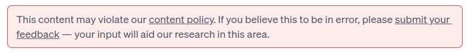

# Chat GPT Anti Violation Policy
Sometimes you can get red block says that content may violate policy like below.

Just put script.js content to browser console and it will save last message ecery 0.1 sec and if red block appear - it will change it to last saved message.
